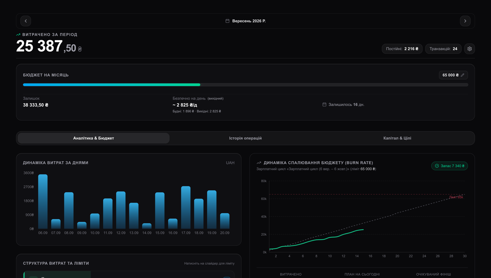
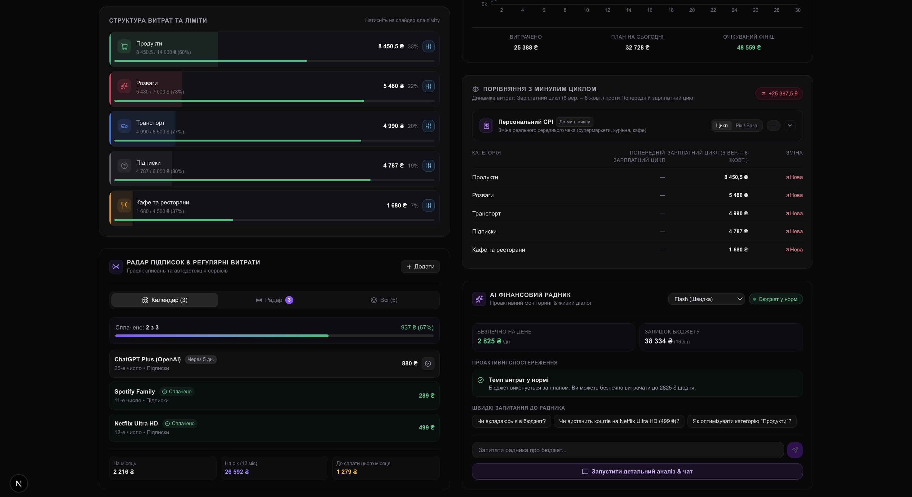
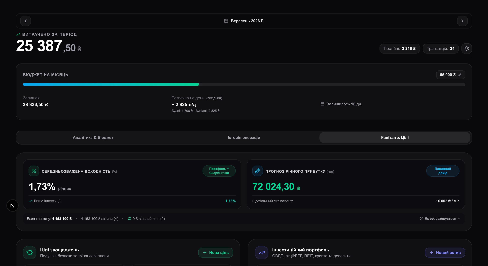
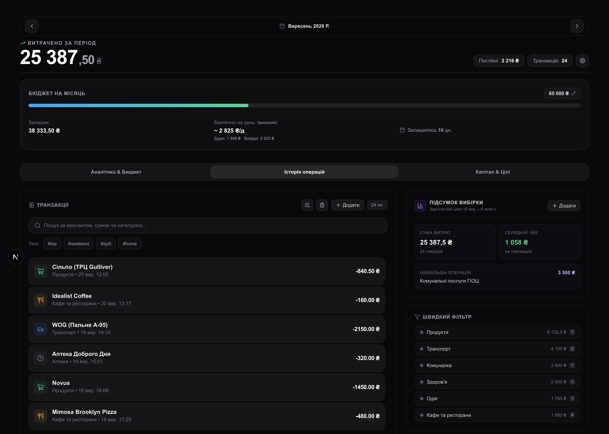
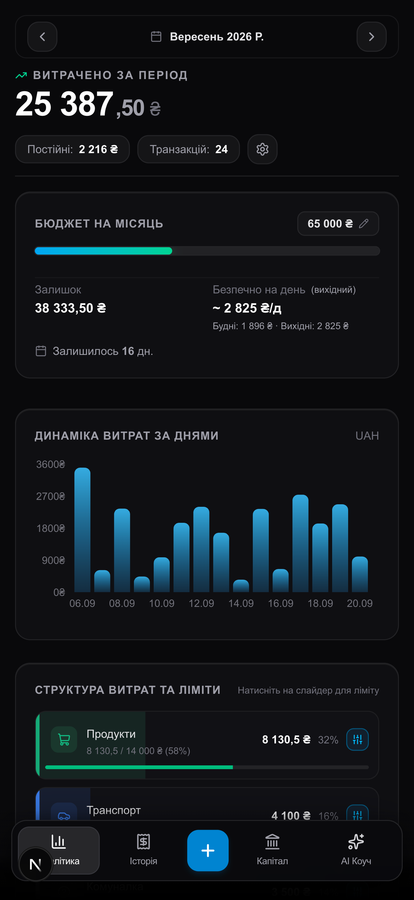
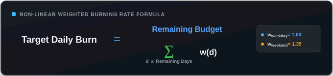
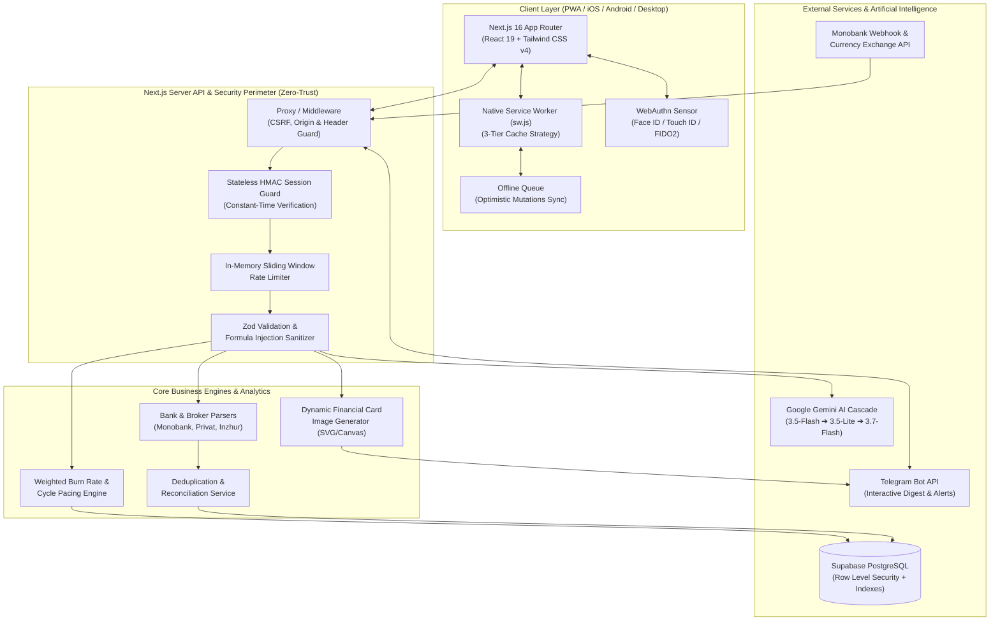
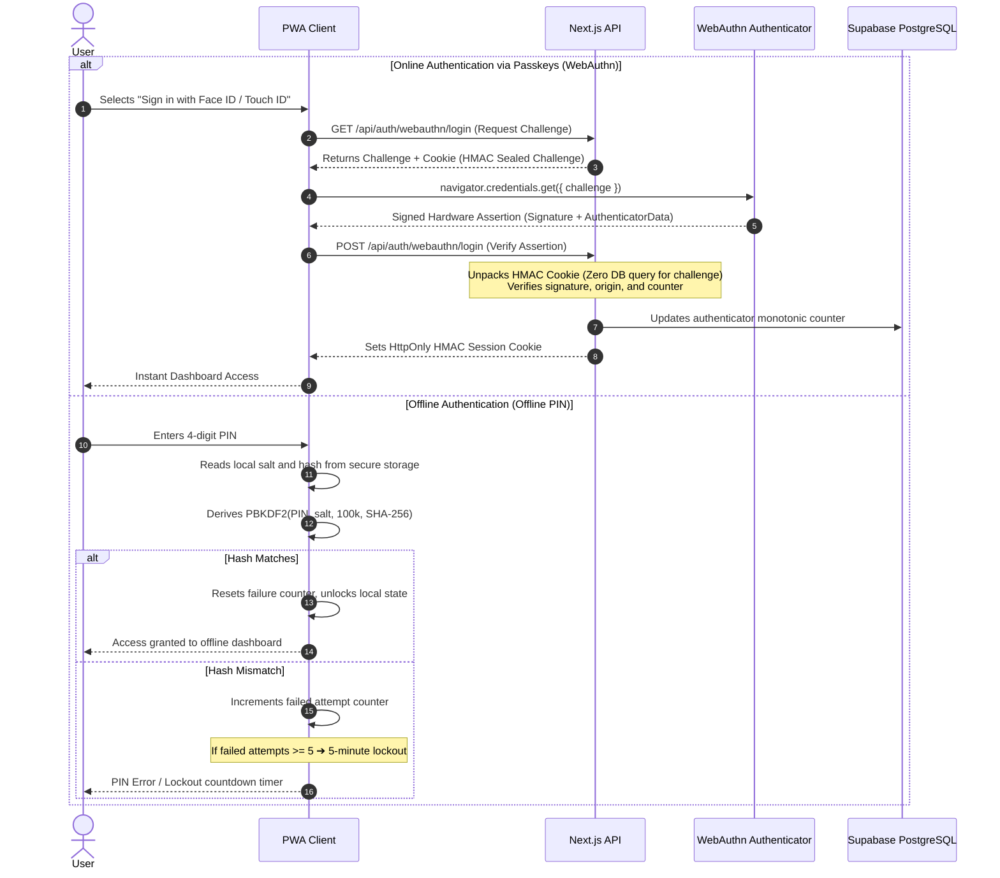
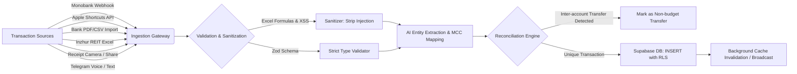

<div align="center">

# 🏛️ BudgetGraph OS

### _Autonomous Personal Finance & Wealth Operating System_

[-21262d?style=for-the-badge&logo=next.js&logoColor=white&labelColor=161b22>)](https://nextjs.org/)
[](https://react.dev/)
[-21262d?style=for-the-badge&logo=typescript&logoColor=3178c6&labelColor=161b22>)](https://www.typescriptlang.org/)
[](https://tailwindcss.com/)
[](https://supabase.com/)
[](https://ai.google.dev/)
[](https://fidoalliance.org/)
[-21262d?style=for-the-badge&logo=vitest&logoColor=4ade80&labelColor=161b22>)](https://vitest.dev/)
[](https://web.dev/progressive-web-apps/)

<p align="center">
  <b>A high-performance autonomous financial command center and next-generation Wealth OS.</b><br/>
  Combines passwordless hardware biometrics (FIDO2 / Passkeys), non-linear cycle mathematics (Weighted Burn Rate), automated broker and bank statement reconciliation, inflation defense (Personal CPI), a multimodal AI copilot powered by Google Gemini, and a full-duplex Telegram bot with real-time infographic generation.
</p>

<p align="center">
  <a href="https://budget-graph-ai-w8r2.vercel.app/?demo=true" target="_blank" rel="noopener noreferrer">
    
  </a>
</p>

[🚀 Live Demo](https://budget-graph-ai-w8r2.vercel.app/?demo=true) •
[📱 UI Showcase](#-application-showcase) •
[✨ Key Features](#-key-capabilities--engineering-features) •
[📐 Architecture](#-system-architecture) •
[🛡️ Zero-Trust Security](#-zero-trust-security-architecture) •
[🧮 FinTech Engine](#-fintech-engine--algorithms) •
[🤖 AI & Telegram](#-multimodal-ai--telegram-ecosystem) •
[📁 Directory Structure](#-repository-structure) •
[🧪 Testing (492 Tests)](#-testing--quality-assurance) •
[📡 API Reference](#-key-api-endpoints) •
[🚀 Quick Start](#-quick-start)

---

</div>

## 📌 Executive Summary

Most personal finance trackers suffer from three fundamental structural flaws:

1. **Calendar Naivety:** They measure cashflow rigidly from the 1st to the 31st of the month, ignoring real-world paycheck cycles and spending elasticity (weekdays vs. weekends).
2. **Network Dependency & Latency:** Adding expenses at a point-of-sale checkout or in an offline environment (subway, airplane, underground parking) is slow or outright fails.
3. **Security Compromises:** Storing plaintext passwords on centralized servers, requesting excessive bank API permissions, and leaving financial telemetry vulnerable to third-party exfiltration.

**BudgetGraph OS** is engineered to modern enterprise FinTech standards:

- **Zero-Trust Security:** Hardware FIDO2 authentication (Face ID / Touch ID), stateless HMAC-sealed challenge cookies with zero database overhead, client-side PBKDF2 offline PIN cryptography with progressive brute-force lockout, and a strict Content Security Policy.
- **Offline-First Resilience:** Seamless operation without internet access via a 3-tier Native Service Worker, background sync queue, and TanStack Query v5 optimistic mutations.
- **Non-Linear Financial Mathematics:** Weighted Burn Rate modeling, Personal CPI tracking via the Laspeyres index formula, Cost-Per-Use (CPU) asset amortization, and penny-accurate (0.01 ₴) transaction split validation.
- **Multi-Agent Multimodal AI:** Cascade of Google Gemini models (2.5 / 3.5 / 3.7 Flash) for real-time receipt OCR via Web Share Target API, full-cycle financial health audits, and Telegram voice message transcription.
- **Automated Multi-Source Reconciliation:** High-performance parsers for bank statements (Monobank, PrivatBank) with noise-stripping and REIT broker reports (Inzhur) with bi-directional transfer deduplication.
- **Interactive In-Memory Sandbox:** Instant zero-setup evaluation populated with realistic financial records (Inzhur REIT distributions, OVDP bonds, Monobank/PrivatBank transactions, and Gemini AI audits) with zero database mutations.

---

## 📱 Application Showcase

<div align="center">
  
  <p><em>Executive Analytics Dashboard: Real-Time Pacing Engine, Burn-Rate Forecasting Curve & Daily Cashflow Dynamics</em></p>
</div>

<br />

<div align="center">
  <table border="0" style="border: none; width: 100%; max-width: 900px;">
    <tr style="border: none;">
      <td width="50%" align="center" valign="top" style="border: none; padding: 8px;">
        <p><b>🤖 AI Co-Pilot (Gemini) & Subscription Radar</b></p>
        
        <p><sub><em>Personal CPI, recurring subscription leak detection, and conversational AI advisor</em></sub></p>
      </td>
      <td width="50%" align="center" valign="top" style="border: none; padding: 8px;">
        <p><b>💎 Wealth Management & Capital OS</b></p>
        
        <p><sub><em>Multi-asset portfolio (Inzhur, OVDP), multi-currency vaults, and Cost-Per-Use (CPU)</em></sub></p>
      </td>
    </tr>
  </table>
</div>

<br />

<div align="center">
  
  <p><b>🔍 Transaction Intelligence & Context Tags</b></p>
  <p><sub><em>Fuzzy search, itemized receipt splitting, and context hashtags (#trip, #weekend)</em></sub></p>
</div>

<br />

<div align="center">
  
  <p><b>📱 Mobile-First PWA Experience</b></p>
  <p><sub><em>Gesture-driven bottom sheets, iOS Safe Area insets, 3-tier Service Worker caching, and full offline resilience</em></sub></p>
</div>

---

## 🌟 Key Capabilities & Engineering Features

### 🛡️ 1. Bank-Grade Security (Zero-Trust)

- **Hardware Biometrics WebAuthn (Passkeys):** Passwordless authentication via Face ID, Touch ID, or hardware security keys (YubiKey) without transmitting credentials over the wire.
- **Stateless Sealed Challenge Tokens:** WebAuthn cryptographic challenges are packaged into HMAC-SHA256 signed `HttpOnly` cookies (Web Crypto API), eliminating database round-trips during the authentication handshake for **Zero DB Latency**.
- **Clone Detection Counter:** Validates the monotonic hardware signature counter on authenticators to defend against replay and cloned key attacks.
- **Offline PIN Cryptographic Engine (`src/lib/offline-pin.ts`):** Client-side authentication via PBKDF2 (100,000 SHA-256 iterations with cryptographic salt). Features an automatic tamper-evident counter that triggers a 5-minute lockout after 5 consecutive failed attempts.
- **Constant-Time Operations:** Protects against timing attacks via `crypto.timingSafeEqual` across all token and PIN verifications.
- **In-Memory Sliding Window Rate Limiting:** Enforces granular request throttles on sensitive endpoints with compliant `Retry-After` headers.
- **Strict Content Security Policy (CSP):** The `connect-src 'self'` directive ensures no session tokens or financial payloads can be exfiltrated by malicious scripts.

### 🧮 2. Non-Linear Financial Mathematics (FinTech Engine)

- **Cycle-First Architecture (`src/lib/cycle-utils.ts`):** Budgets are synchronized with dynamic paycheck cycles (e.g., 10th to 9th of next month) rather than artificial calendar boundaries.
- **Weighted Pacing & Burn Rate Simulator (`src/lib/weighted-pacing.ts`):**

  <p align="center">
    
  </p>

  Incorporates weekend spending elasticity (`w_weekday = 1.0`, `w_weekend = 1.35`) to produce an achievable, realistic daily allowance curve.

- **Personal CPI (Personal Inflation Index) (`src/lib/personal-cpi.ts`):** Calculates a Laspeyres-weighted consumer basket inflation rate across expenditure categories compared to previous cycles.
- **Subscription Leak Radar (`src/lib/subscription-radar/`):** Automated recurring expense detector analyzing cadence intervals and merchant signatures to surface forgotten subscriptions.
- **Cost-Per-Use (CPU) Tracker (`src/components/dashboard/modals/AddCostPerUseModal.tsx`):** Quantifies return on investment for major purchases (electronics, gear, clothing) by amortizing cost over usage frequency and ownership lifespan.
- **Runway & Emergency Fund Simulator:** Calculates financial runway reserves (months of baseline survival upon unexpected income cessation).
- **Penny-Accurate Transaction Split (`src/components/SplitTransactionModal.tsx`):** Distributes itemized receipts across budget envelopes with exact penny balance enforcement (0.01 ₴).
- **Smart Round-Up ("Spare Change Vaults") (`src/lib/roundup-utils.ts`):** Virtual coin round-ups (to the nearest 10, 50, or 100 ₴) accelerating targeted savings goals.

### 🤖 3. Multimodal AI Financial Partner (Google Gemini)

- **Cascade Multi-Model Fallback:**
  - Primary analytical intelligence: `gemini-3.5-flash` / `gemini-2.5-flash`.
  - Sub-second categorization & network fallback: `gemini-3.5-flash-lite`.
  - Heavy synthesis and end-of-cycle audits: `gemini-3.7-flash`.
- **Web Share Target Receipt OCR (`/share-target`):** Share photos of paper receipts or bank PDFs directly from the native iOS/Android system share sheet — Gemini Vision extracts merchant name, date, currency, total, line items, and assigns categories instantly.
- **Context-Aware Financial Advisor (`src/components/AIAnalysisDrawer.tsx`):** Conversational advisor aware of complete spending velocity, category limits, and historical trends, providing proactive recommendations and dynamic prompt chips.
- **Apple Shortcuts Instant Classifier (`/api/classify`):** Low-latency edge route processing transaction push notifications from Apple Pay in under 400ms.

### 📲 4. Full-Duplex Telegram Bot & Dynamic Canvas Generator

- **Interactive Telegram Webhook (`/api/webhooks/telegram`):** Inline keyboard actions, rapid expense input, and real-time category balance checks directly from messenger.
- **Natural Language & Voice Parser:** Transcribes voice notes and parses free-form text (e.g., _"Coffee 85 snacks"_) via heuristics and Gemini models.
- **"What-If" Simulations & Runway Queries:** Simulates the effect of discretionary purchases on cycle runway before the transaction happens.
- **Dynamic Image Generator (`src/lib/dashboard-image/generator.tsx`):** Renders crisp serverless visual financial dashboard cards (SVG/Canvas) dispatched directly in Telegram digests.

### 🏦 5. Wealth OS & Intelligent Reconciliation

- **Multi-Asset Ledger:** Real Estate (Inzhur REITs), Ukrainian Treasury Bonds (OVDP), Global Equities, Crypto, Cash, and Multi-Currency Bank Accounts.
- **Inzhur REIT Import & Reconciliation:** Parses broker Excel/CSV exports and deduplicates transfers against bank checking accounts to prevent double-counting.
- **Sanitized Bank Statement Parsers:** Tokenizes PDF/CSV statements from Monobank and PrivatBank, stripping terminal noise (terminal IDs, city tags, transaction timestamps, EDRPOU) and neutralizing **CSV Formula Injection** (`=`, `@`, `+`, `-`).
- **Monobank Webhook Integration (`/api/webhooks/monobank`):** Real-time Monobank transaction ingestion with automatic MCC categorization and merchant normalization.

### 🗓️ 6. Financial Calendar & Proactive Event Radar

- **Interactive Horizon Timeline (`src/components/dashboard/modals/FinancialCalendarModal.tsx`):** Triggered instantly from the "X days left" badge on the Monthly Budget card.
- **Dynamic Cycle Boundaries (`src/lib/cycle-utils.ts`):** Projects nominal 1-month cycle end dates with automatic day-by-day extension if an active cycle remains unclosed, visually separating active from inactive dates.
- **Cross-Domain Asset Synchronization:** Mappings for recurring subscriptions, bond maturity dates (OVDP), term deposit returns, and recurring Inzhur REIT dividends (10th of every month).
- **Custom Financial Events (CRUD):** User-defined milestones with completion tracking, category tags, and database persistence in Supabase with RLS.
- **Proactive Telegram Alert Radar (`/api/cron/calendar-alerts`):** Automated morning cadence scanning horizons of `0 (today) -> 1 -> 3 -> 7` days, with selective muting for channels with native push notifications.

### ⚡ 7. Offline-First PWA & Mobile Ergonomics

- **3-Tier Native Service Worker (`public/sw.js`):**
  - `Network-Only`: For sensitive biometric routes, PIN verification, and exports.
  - `Network-First with Cache Fallback`: For live transaction ledgers and financial queries.
  - `Stale-While-Revalidate`: For static JavaScript and CSS Next.js chunks.
- **Background Sync Queue (`src/lib/offline-queue.ts`):** Records transactions offline in IndexedDB and transparently replays them upon network recovery.
- **Mobile Ergonomics & Zero Layout Shift:** All dialogs adapt as native Bottom Sheets adhering to `env(safe-area-inset-bottom)`, scroll isolation (`overscroll-contain`), and virtual keyboard height stabilization.

---

## 📐 System Architecture

### 1. High-Level System Topology



---

### 2. Zero-Trust WebAuthn & Offline PIN Handshake



---

### 3. Transaction Ingestion & Reconciliation Pipeline



---

## 🛠️ Technology Stack & Engineering Rationale

| Component                   | Technology                     | Version         | Engineering Rationale                                                                          |
| :-------------------------- | :----------------------------- | :-------------- | :--------------------------------------------------------------------------------------------- |
| **Framework**               | **Next.js (App Router)**       | `16.3.4`        | Server Actions, Route Handlers, Turbopack build pipeline, zero Express overhead.               |
| **UI Library**              | **React**                      | `19.2.8`        | Latest React engine with native concurrent features and high-efficiency rendering.             |
| **Language**                | **TypeScript**                 | `5.9.3`         | Strict mode (`strict: true`), zero untyped `any`, end-to-end type safety from schema to UI.    |
| **Styling**                 | **Tailwind CSS**               | `v4.0`          | High-performance Rust-based engine, zero runtime CSS footprint, and clean design tokens.       |
| **Database**                | **Supabase (PostgreSQL)**      | `Latest`        | Row Level Security (RLS), soft-delete triggers, and composite B-Tree indexes for fast queries. |
| **Artificial Intelligence** | **Google GenAI SDK**           | `@google/genai` | Native integration with Gemini 2.5/3.5/3.7 Flash models, structured outputs, low latency.      |
| **Biometrics**              | **SimpleWebAuthn**             | `v14.0`         | Comprehensive FIDO2/WebAuthn Level 3 implementation for passwordless biometric login.          |
| **Server State**            | **TanStack React Query**       | `v5.102`        | Optimistic UI updates, smart cache invalidation, and automatic background refetching.          |
| **Data Visualization**      | **Recharts**                   | `v3.10`         | Declarative financial charts with smooth animations and responsive interactive tooltips.       |
| **Spreadsheet Parsing**     | **SheetJS (`xlsx`)**           | `v0.20.3`       | High-speed client/server parsing of complex banking statements and broker spreadsheets.        |
| **Test Runner**             | **Vitest**                     | `v5.0.0`        | Ultra-fast ESM test runner with native TypeScript support. **484 tests pass in ~6 seconds**.   |
| **Code Formatting**         | **Prettier + Tailwind Plugin** | `v3.9`          | Automated code alignment and utility class sorting enforced via pre-push Git hooks.            |

---

## 📁 Repository Structure

The codebase is organized around a **Domain-Driven Modular Architecture** ensuring strict separation of concerns:

```text
budget-pwa/
├── .github/                      # CI/CD pipelines (GitHub Actions)
│   └── workflows/ci.yml          # Prettier, TypeScript, Vitest, and Build checks
├── public/                       # Static assets, PWA icons, and Service Worker
│   ├── sw.js                     # 3-tier Native Service Worker with offline caching
│   └── manifest.json             # Web App Manifest
├── src/
│   ├── __tests__/                # 47 test suites (484 unit and integration tests)
│   │   ├── ai-chat.test.ts
│   │   ├── bank-statement-parser.test.ts
│   │   ├── behavioral-finance.test.ts
│   │   ├── burn-rate-cycle.test.ts
│   │   ├── offline-pin-security.test.ts
│   │   ├── personal-cpi.test.ts
│   │   ├── telegram-webhook.test.ts
│   │   └── weighted-pacing.test.ts
│   ├── app/                      # Next.js 16 App Router
│   │   ├── api/                  # 34 modular REST & Webhook endpoints
│   │   │   ├── ai/               # /analyze, /chat (Gemini AI Advisor)
│   │   │   ├── analytics/        # /budget-pace, /personal-cpi
│   │   │   ├── auth/             # /auth, /webauthn/login, /webauthn/register
│   │   │   ├── cron/             # /recurring, /digest, /pacing-alerts
│   │   │   ├── transactions/     # /transactions, /split, /restore, /import-csv, /import-inzhur
│   │   │   └── webhooks/         # /monobank, /telegram
│   │   ├── share-target/         # PWA Web Share Target receipt upload screen
│   │   ├── layout.tsx            # Root shell with PWA metadata and theme providers
│   │   └── page.tsx              # Primary executive financial dashboard
│   ├── components/               # Modular UI Component library
│   │   ├── ai-drawer/            # AI Financial Advisor, chat stream, prompt chips
│   │   ├── auth/                 # WebAuthn biometric screens & numeric PIN keypad
│   │   ├── bank-statement/       # File drag-and-drop & parsing preview modals
│   │   ├── dashboard/            # Analytics widgets and dashboard cards
│   │   │   ├── budget-summary/   # Hero summary metrics and pacing indicators
│   │   │   ├── burn-rate/        # Burn Rate trajectory curves & daily bars
│   │   │   ├── category-breakdown/# Category progress bars & limit modals
│   │   │   ├── investments/      # Capital allocation, yield metrics, asset breakdown
│   │   │   ├── mom-comparison/   # Month-over-month trends and Personal CPI
│   │   │   ├── savings-goals/    # Savings vaults and deposit dialogs
│   │   │   └── subscription-radar/# Recurring subscription leak detector
│   │   ├── merchant-rules/       # Custom merchant auto-categorization rules
│   │   └── split-transaction/    # Multi-category receipt splitting interface
│   ├── constants/                # Domain constants (categories, icons, color palettes)
│   ├── hooks/                    # Custom React hooks
│   │   ├── auth/                 # usePinAuth, useWebAuthn
│   │   ├── finance-queries/      # TanStack Query selectors & cache keys
│   │   ├── transaction-mutations/# Optimistic mutation handlers & offline queue
│   │   └── useBudgetMetrics.ts   # Core aggregated cycle mathematics coordinator
│   ├── lib/                      # Core business logic and infrastructure services
│   │   ├── bank-statement/       # Bank statement tokenizers, cleaners, and parsers
│   │   ├── bot/                  # Telegram bot commands, callbacks, and formatters
│   │   ├── dashboard-image/      # Serverless infographic card generator (SVG/Canvas)
│   │   ├── financial-ai-assistant/# Gemini prompt definitions and report generators
│   │   ├── inzhur/               # Inzhur REIT statement parser and reconciliation
│   │   ├── pacing/               # Weighted pacing calculations and simulators
│   │   ├── demo-data.ts          # Realistic mock dataset for interactive demo mode
│   │   ├── offline-pin.ts        # PBKDF2 cryptographic offline access engine
│   │   ├── offline-queue.ts      # Offline IndexedDB synchronization queue
│   │   ├── personal-cpi.ts       # Laspeyres basket inflation index algorithm
│   │   ├── rate-limiter.ts       # In-memory sliding window rate limiter
│   │   ├── roundup-utils.ts      # Spare change coin round-up calculations
│   │   ├── session.ts            # Web Crypto HMAC cryptographic session tokens
│   │   └── validations.ts        # Zod validation schemas across all entities
│   ├── proxy.ts                  # Reverse-proxy boundary and security headers
│   └── types/                    # Domain TypeScript types (Finance, AI, DB, Auth)
└── supabase/
    └── migrations/               # 9 production SQL migrations (RLS, indexes, soft-delete, cache, calendar)
```

---

## 🛡️ Zero-Trust Security Architecture

| Security Layer                     | Implementation Details                                                                                       |
| :--------------------------------- | :----------------------------------------------------------------------------------------------------------- |
| **FIDO2 / Hardware Security**      | Passwordless login via biometric sensors and hardware security keys (SimpleWebAuthn v14).                    |
| **Stateless Sealed Tokens**        | WebAuthn challenges are encrypted in HMAC tokens and verified without database lookups (Zero DB Latency).    |
| **Clone Attack Prevention**        | Authenticator monotonic counter verification prevents replay attacks and cloned credentials.                 |
| **Cryptographic Offline PIN**      | Client-side PBKDF2 (100k SHA-256 iterations) with progressive 5-minute lockout after 5 consecutive failures. |
| **Constant-Time Verification**     | Prevents timing attacks across all tokens and PIN secrets via `crypto.timingSafeEqual`.                      |
| **Sliding Window Rate Limiter**    | In-memory sliding-window throttling on authentication, AI endpoints, and public webhooks.                    |
| **Strict Content Security Policy** | Header directive `connect-src 'self'` blocks token exfiltration by malicious third-party scripts.            |
| **CSV / Formula Injection Shield** | Sanitizes dangerous spreadsheet formula prefixes (`=`, `+`, `-`, `@`, `\t`, `\r`) in all exports.            |
| **Database Row Level Security**    | 100% of Supabase tables are locked down with RLS; access is only granted to validated sessions.              |
| **10-Day Trash / Soft Delete**     | Defends against accidental data loss with a 10-day quarantine retention window and 1-click restore.          |

---

## 🧪 Testing & Quality Assurance

BudgetGraph OS maintains **100% test coverage across core financial calculations and security protocols**:

```bash
# Run the complete test suite (492 tests)
npm test

# Verify strict TypeScript typing (0 errors)
npx tsc --noEmit

# Verify code style with Prettier
npm run format:check

# Production build via Next.js Turbopack
npm run build
```

### Breakdown of the 49 Test Suites:

- **Cryptography & Security:** Validates PBKDF2 offline PIN hashing, brute-force lockout thresholds, WebAuthn assertion verification, and HMAC session security (`offline-pin-security.test.ts`, `webauthn-speed-security.test.ts`).
- **Financial Calculus:** Weighted Burn Rate modeling, Personal CPI inflation indexing, dynamic cycle end-date calculations, penny-accurate transaction splits, and round-up savings rules (`burn-rate-cycle.test.ts`, `weighted-pacing.test.ts`, `personal-cpi.test.ts`, `cycle-utils.test.ts`, `split-cascade-rollback.test.ts`).
- **Financial Calendar & Alerts:** Cross-domain event aggregation, maturity date projections, auto-extension mechanics, and proactive Telegram radar scheduling (`calendar-events.test.ts`, `calendar-alerts-cron.test.ts`).
- **Parsers & Ingestion:** Statement parsing for PrivatBank, Monobank, and Inzhur REIT reports, formula injection defense, and noise stripping (`bank-statement-parser.test.ts`, `inzhur-import.test.ts`, `receipt-pdf-import.test.ts`).
- **Telegram Webhook & AI:** Command parsing, callback query dispatch, infographic canvas rendering, error fallbacks, and token authentication (`telegram-webhook.test.ts`, `ai-chat.test.ts`, `financial-ai-assistant.test.ts`).
- **Fuzzing & Boundary Testing:** Randomized property-based testing across edge-case financial numbers and date boundaries (`financial-fuzz.test.ts`).

---

## 📡 Key API Endpoints

| Route                             |                Method               | Purpose                                          | Security & Architecture                         |
| :-------------------------------- | :---------------------------------: | :----------------------------------------------- | :---------------------------------------------- |
| `/api/auth`                       |               `POST`                | Authenticate using PIN code                      | Constant-time comparison, Rate limited          |
| `/api/auth/webauthn/login`        |           `GET` / `POST`            | WebAuthn challenge generation & verification     | Stateless sealed HMAC challenge, Counter check  |
| `/api/auth/webauthn/register`     |           `GET` / `POST`            | Register a new FIDO2 biometric device            | Session required, WebAuthn registration verify  |
| `/api/classify`                   |               `POST`                | Sub-second categorizer for Apple Shortcuts       | Bearer secret, AI Rate limiter, Gemini fallback |
| `/api/ai/analyze`                 |               `POST`                | Comprehensive cycle financial health audit       | Session token, Gemini cascade engine            |
| `/api/ai/chat`                    |               `POST`                | Conversational financial copilot session         | Streaming SSE response, Session token           |
| `/api/transactions`               |           `GET` / `POST`            | Ingest and retrieve financial records            | Zod validation, Optimistic cache sync           |
| `/api/transactions/split`         |               `POST`                | Split a transaction across multiple categories   | Penny balance exact match verification ($0.01)  |
| `/api/transactions/restore`       |               `POST`                | Restore a transaction from the soft-delete trash | 10-day safety retention window                  |
| `/api/transactions/import-csv`    |               `POST`                | Ingest and parse bank statements                 | Memory stream, CSV injection sanitizer          |
| `/api/transactions/import-inzhur` |               `POST`                | Ingest Inzhur REIT investment reports            | Reconciliation engine, Deduplication            |
| `/api/calendar/events`            | `GET` / `POST` / `PATCH` / `DELETE` | Cross-domain calendar events aggregation & CRUD  | Session required, Zod schema validation, RLS    |
| `/api/cron/calendar-alerts`       |                `GET`                | Morning Telegram radar for upcoming maturities   | Vercel Cron Secret, Proactive cadence engine    |
| `/api/webhooks/monobank`          |               `POST`                | Official Monobank webhook integration            | Signature verification, Auto-classification     |
| `/api/webhooks/telegram`          |               `POST`                | Full-duplex Telegram bot interaction             | Secret token header guard, Canvas generator     |
| `/api/recurring/radar`            |                `GET`                | Automated subscription leak detection            | Transaction signature pattern engine            |
| `/api/cron/pacing-alerts`         |                `GET`                | Friday weekend radar & Monday reset alerts       | Vercel Cron Secret, Proactive alert engine      |
| `/api/cron/digest`                |                `GET`                | Daily evening summary dispatch to Telegram       | Vercel Cron Secret, Canvas graph dispatch       |

---

## 🚀 Quick Start

### 🎮 Interactive Demo Sandbox (Zero Setup Required)

#### 🌐 Option A: Instant Web Access (Zero Installation)

Explore the deployed production build instantly in your browser:  
👉 **[https://budget-graph-ai-w8r2.vercel.app/?demo=true](https://budget-graph-ai-w8r2.vercel.app/?demo=true)**

#### 💻 Option B: Local 60-Second Run

Want to run and inspect the sandbox locally?

```bash
# 1. Clone the repository and install dependencies
git clone https://github.com/mindeclipse/Budget_graphAI.git
cd Budget_graphAI
npm ci --legacy-peer-deps

# 2. Launch development server
npm run dev
```

Open **[http://localhost:3000/?demo=true](http://localhost:3000/?demo=true)** or click **"✨ Спробувати Демо-режим"** at the bottom of the authentication lock screen.

- **Pre-populated Dataset:** Realistic multi-asset portfolios (Inzhur REIT distributions, OVDP bonds, multi-currency vaults), categorized bank statements, recurring subscription radars, and dynamic pacing burn curves.
- **Zero-Risk & Offline:** Runs entirely in-memory with client-side state caching. No database mutations or cloud credentials needed.

---

### 🛠️ Production Setup (With Cloud Backend)

Follow these steps to deploy BudgetGraph OS with your own private Supabase database and external API integrations:

#### Prerequisites

- **Node.js:** version `22.x` or higher
- **npm:** version `10.x` or higher
- A **Supabase** account (PostgreSQL) and a **Google Gemini API** key

#### 1. Environment Configuration

Create a `.env.local` file in the root directory:

```env
# Supabase Database Configuration
NEXT_PUBLIC_SUPABASE_URL=https://your-project.supabase.co
NEXT_PUBLIC_SUPABASE_ANON_KEY=your-anon-key
SUPABASE_SERVICE_ROLE_KEY=your-service-role-key

# Application Access & Session Cryptography
APP_ACCESS_PIN=1234
APP_API_SECRET=your-32-byte-secret-key-for-shortcuts-and-hmac

# Google Gemini API
GEMINI_API_KEY=your-gemini-api-key

# Telegram Bot Integration (Optional)
TELEGRAM_BOT_TOKEN=your-telegram-bot-token
TELEGRAM_CHAT_ID=your-telegram-chat-id
TELEGRAM_WEBHOOK_SECRET=your-webhook-secret

# Monobank Integration (Optional)
MONOBANK_TOKEN=your-monobank-personal-token

# Cron Tasks Secret
CRON_SECRET=your-cron-secret-key
```

### 4. Database Setup

Apply the SQL migration scripts located in `supabase/migrations/` using the Supabase SQL Editor to set up schemas, RLS policies, and performance indexes.

### 5. Launch Development Server

```bash
npm run dev
```

Open [http://localhost:3000](http://localhost:3000) in your browser.

> [!TIP]
> **Interactive Demo Mode:**  
> BudgetGraph OS includes an offline demo mode for instant testing without configuring a database. Navigate to [http://localhost:3000/?demo=true](http://localhost:3000/?demo=true) or click **"Спробувати Демо-режим"** on the authentication screen to explore fully populated charts, budgets, subscriptions, and investments.

---

## 👨‍💻 Author & Engineering Contacts

Designed and engineered as a showcase of modern mission-critical web software architecture: from low-level Web Crypto and non-linear algorithms to fluid mobile UX, offline resilience, and generative AI synergy.

- **Lead Engineer:** Yurii Khval ([@mindeclipse](https://github.com/mindeclipse))
- **Email:** [yukhval@gmail.com](mailto:yukhval@gmail.com)
- **LinkedIn:** [linkedin.com/in/yuriikhval](https://linkedin.com/in/yuriikhval)

---

<div align="center">
  <sub>Crafted with mathematical rigor, uncompromising privacy standards, and passion for elegant code.</sub>
</div>
