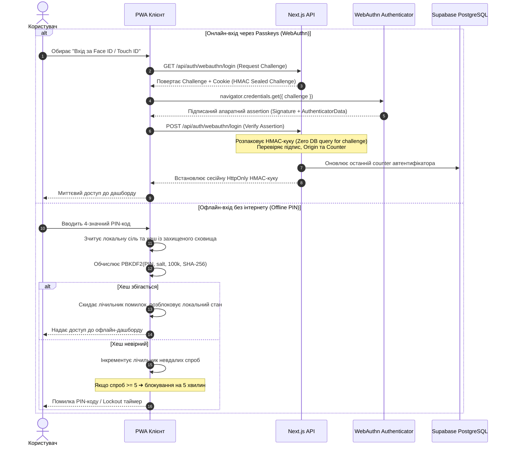
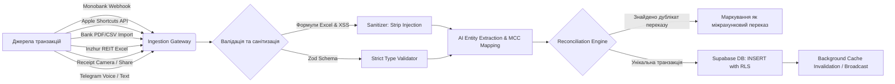

<div align="center">

# 🏛️ BudgetGraph OS

### _Autonomous Personal Finance & Wealth Operating System_

[-black?style=for-the-badge&logo=next.js>)](https://nextjs.org/)
[](https://react.dev/)
[-3178c6?style=for-the-badge&logo=typescript>)](https://www.typescriptlang.org/)
[](https://tailwindcss.com/)
[](https://supabase.com/)
[](https://ai.google.dev/)
[](https://fidoalliance.org/)
[-6da55f?style=for-the-badge&logo=vitest>)](https://vitest.dev/)
[](https://web.dev/progressive-web-apps/)
[](LICENSE)

<p align="center">
  <b>Високонавантажений автономний фінансовий командний центр та Wealth OS нового покоління.</b><br/>
  Поєднує безпарольну апаратну біометрію WebAuthn (FIDO2 / Passkeys), нелінійну математику зарплатних циклів (Weighted Burn Rate), автоматизовану реконсиляцію брокерських та банківських виписок, захист від інфляції (Personal CPI), мультимодальний AI-асистент на базі Google Gemini та двосторонній Telegram-бот із генерацією інфографіки в реальному часі.
</p>

[✨ Можливості](#-ключові-можливості-та-інженерні-фічі) •
[📐 Архітектура](#-архітектура-системи) •
[🛡️ Zero-Trust Безпека](#-архітектура-безпеки-zero-trust) •
[🧮 Фінансовий двигун](#-фінансовий-двигун-та-алгоритми) •
[🤖 AI & Telegram екосистема](#-мультимодальний-ai-та-telegram-екосистема) •
[📁 Структура кодової бази](#-структура-кодової-бази) •
[🧪 Тестування (484 тести)](#-тестування-та-якість-коду) •
[📡 API Ендпоінти](#-ключові-api-ендпоінти) •
[🚀 Швидкий старт](#-швидкий-старт)

---

</div>

## 📌 Чому цей проєкт особливий (Executive Summary)

Більшість персональних трекерів фінансів страждають від трьох фундаментальних вад:

1. **Календарна наївність:** Вони вимірюють витрати з 1 по 31 число, ігноруючи реальні зарплатні цикли людини та нерівномірність витрат (будні vs вихідні).
2. **Низька швидкість та залежність від мережі:** Затримки при додаванні витрат на касі або неможливість внести запис у метро без зв'язку.
3. **Компроміси безпеки:** Збереження паролів на серверах, надмірні права API та вразливість до витоку персональних транзакцій.

**BudgetGraph OS** спроєктовано за стандартами сучасного корпоративного FinTech:

- **Zero-Trust Security:** Апаратна FIDO2-автентифікація (Face ID / Touch ID), Stateless HMAC-підписані челенджі без навантаження на БД, клієнтський криптографічний PBKDF2 Offline PIN із захистом від брутфорсу та суворий CSP.
- **Offline-First Resilience:** Повна працездатність без інтернету через Native Service Worker, синхронізаційну чергу та оптимістичні мутації TanStack Query v5.
- **Non-Linear Financial Mathematics:** Зважений темп спалювання бюджету (Weighted Burn Rate), персональний індекс інфляції (Personal CPI), амортизація вартості використання речей (Cost-Per-Use) та математична точність сплітів транзакцій до копійки.
- **Multi-Agent Multimodal AI:** Каскад моделей Google Gemini (2.5 / 3.5 / 3.7 Flash) для розпізнавання чеків на льоту через Web Share Target API, аналітики циклу та обробки голосових повідомлень у Telegram.
- **Automated Multi-Source Reconciliation:** Інтелектуальний парсер PDF/CSV виписок Monobank/ПриватБанку з очищенням від банківського сміття та звітів REIT-фондів (Inzhur) із дедуплікацією зустрічних переказів.

---

## 🌟 Ключові можливості та інженерні фічі

### 🛡️ 1. Безпека банківського рівня (Zero-Trust)

- **Апаратна біометрія WebAuthn (Passkeys):** Вхід через Face ID, Touch ID або апаратні FIDO2-ключі без передачі будь-яких паролів мережею.
- **Stateless Sealed Challenge Tokens:** Криптографічний челендж для WebAuthn пакується в підписаний HMAC-SHA256 токен у `HttpOnly` cookie (Web Crypto API). Це виключає зайвий запис/читання в БД під час рукостискання та забезпечує **Zero DB Latency**.
- **Clone Detection Counter:** Перевірка монотонно зростаючого апаратного лічильника `counter` у WebAuthn-автентифікаторі для запобігання клонуванню ключів.
- **Offline PIN Cryptographic Engine (`src/lib/offline-pin.ts`):** Локальна валідація PIN-коду без доступу до сервера через PBKDF2 (100 000 ітерацій SHA-256 із сіллю). Включає криптографічний лічильник невдалих спроб і блокування (Lockout) на 5 хвилин після 5 помилок поспіль.
- **Constant-Time Operations:** Захист від атак за часом виконання (Timing Attacks) за допомогою `crypto.timingSafeEqual`.
- **In-Memory Sliding Window Rate Limiter:** Захист ендпоінтів від перебору та DoS із заголовками `Retry-After`.
- **Strict Content Security Policy (CSP):** Директива `connect-src 'self'` повністю блокує витік сесійних даних на сторонні сервери навіть у разі стороннього скриптового втручання.

### 🧮 2. Нелінійна фінансова математика (FinTech Engine)

- **Cycle-First Architecture (`src/lib/cycle-utils.ts`):** Бюджет прив'язаний до плаваючих зарплатних циклів (наприклад, з 10 по 9 число наступного місяця), а не штучних календарних місяців.
- **Weighted Pacing & Burn Rate Simulator (`src/lib/weighted-pacing.ts`):**
  $$\text{Target Daily Burn} = \frac{\text{Remaining Budget}}{\sum_{d \in \text{Remaining Days}} w(d)}$$
  Враховує коефіцієнти еластичності витрат ($w_{\text{weekday}} = 1.0$, $w_{\text{weekend}} = 1.35$), моделюючи реалістичний темп замість наївного ділення на залишок днів.
- **Personal CPI (Індекс персональної інфляції) (`src/lib/personal-cpi.ts`):** Розрахунок зваженого індексу споживчих цін для особистого кошика покупок у порівнянні з попередніми циклами за формулою Ласпейреса.
- **Cost-Per-Use Tracker (`AddCostPerUseModal.tsx`):** Оцінка реальної вартості використання довгострокових активів (техніка, одяг, спорядження) на основі днів володіння та частоти експлуатації.
- **Runway & Emergency Fund Runway:** Прогнозування запасу міцності фінансової подушки (кількість місяців виживання при поточному темпі базових витрат).
- **Penny-Accurate Transaction Split (`SplitTransactionModal.tsx`):** Алгоритм розподілу чека між категоріями із суворим контролем балансу до 1 копійки ($0.01$).
- **Smart Round-Up ("Скарбничка / Решта") (`src/lib/roundup-utils.ts`):** Віртуальне заокруглення витрат до найближчого кроку (10, 50, 100 ₴) для прискореного накопичення на цілі.

### 🤖 3. Мультимодальний AI-асистент (Google Gemini)

- **Cascade Multi-Model Fallback:**
  - Основна модель аналітики: `gemini-3.5-flash` / `gemini-2.5-flash`.
  - Швидка класифікація та відмовостійкий фолбек: `gemini-3.5-flash-lite`.
  - Важкі аналітичні звіти: `gemini-3.7-flash`.
- **Web Share Target Receipt OCR (`/share-target`):** Можливість поділитися фото чека або PDF прямо з меню iOS/Android "Поділитися" — Gemini Vision миттєво виділяє дату, валюту, суму, розпізнає позиції та призначає категорію.
- **Context-Aware Financial Advisor (`src/components/AIAnalysisDrawer.tsx`):** Інтерактивний чат-радник, який володіє повним контекстом поточного циклу, аналізує аномалії, пропонує оптимізації та генерує персоналізовані динамічні чіпси запитань.
- **Apple Shortcuts Instant Classifier (`/api/classify`):** Субсекундний серверний ендпоінт для миттєвої категоризації повідомлень банку через Apple Shortcuts прямо під час оплати через Apple Pay.

### 📲 4. Двосторонній Telegram-бот та Dynamic Canvas Generator

- **Повнофункціональний Telegram Webhook (`/api/webhooks/telegram`):** Підтримка інтерактивних інлайн-кнопок, швидкого додавання витрат та управління бюджетом прямо з месенджера.
- **Natural Language & Voice Parser:** Розуміння довільного тексту (наприклад, _"Сільпо 640 продукти"_) та голосових нотаток через AI-транскрипцію.
- **"What-If" сценарії та Emergency Fund команди:** Моделювання впливу спонтанної покупки на бюджет циклу прямо в чаті.
- **Dynamic Image Generator (`src/lib/dashboard-image/generator.tsx`):** Генерація естетичних карток фінансового дашборду у високій роздільній здатності (SVG/Canvas) для надсилання у щоденних та тижневих Telegram-звітах.

### 🏦 5. Управління капіталом (Wealth OS) та інтелектуальна реконсиляція

- **Багатоактивний облік:** Акції, облігації (ОВДП), REIT-нерухомість, криптовалюти, готівка та мультивалютні депозити.
- **Inzhur REIT Import & Reconciliation:** Парсинг брокерських звітів та автоматична дедуплікація переказів між банківською картою та фондом для запобігання подвійному обліку капіталу.
- **Sanitized Bank Statement Parsers:** Парсинг PDF/CSV виписок ПриватБанку та Monobank із санітизацією від службового сміття (номери терміналів, міські мітки, ЄДРПОУ, транзитні рахунки) та захистом від **CSV Formula Injection** (`=`, `@`, `+`, `-`).
- **Monobank Webhook Integration (`/api/webhooks/monobank`):** Прямий вебхук для миттєвої реєстрації банківських операцій з автоматичним мапінгом MCC-кодів.

### ⚡ 6. Offline-First PWA та мобільна ергономіка

- **Трьохрівневе кешування Service Worker (`public/sw.js`):**
  - `Network-Only`: для критичних біометричних маршрутів та бекапів.
  - `Network-First з Cache Fallback`: для транзакційного списку та аналітики.
  - `Stale-While-Revalidate`: для статичних JS/CSS чанків Next.js.
- **Синхронізаційна черга (`src/lib/offline-queue.ts`):** Накопичення транзакцій у локальному сховищі в режимі літака або відсутності зв'язку з миттєвим background replay при відновленні мережі.
- **Mobile Ergonomics & Zero Layout Shift:** Усі модальні вікна розроблені за принципом адаптивних штор (Bottom Sheets) із повною підтримкою `env(safe-area-inset-bottom)`, ізоляцією скролу (`overscroll-contain`) та усуненням стрибків в'юпорту при появі віртуальної клавіатури.

---

## 📐 Архітектура системи

### 1. Загальна топологія системи


---

### 2. Zero-Trust WebAuthn & Offline PIN рукостискання



---

### 3. Пайплайн обробки та реконсиляції транзакцій



---

## 🛠️ Технологічний стек та обґрунтування вибору

| Компонент            | Технологія                     | Версія          | Інженерне обґрунтування вибору                                                                                   |
| :------------------- | :----------------------------- | :-------------- | :--------------------------------------------------------------------------------------------------------------- |
| **Framework**        | **Next.js (App Router)**       | `16.3.4`        | Server Actions, Route Handlers, оптимізований Turbopack-білд, відсутність overhead традиційного Express-сервера. |
| **UI Library**       | **React**                      | `19.2.8`        | Останнє покоління React з нативними оптимізаціями рендерингу та Concurrent features.                             |
| **Мова**             | **TypeScript**                 | `5.9.3`         | Суворий режим (`strict: true`), повна відсутність `any`, валідована типобезпека від бази даних до компонентів.   |
| **Стилізація**       | **Tailwind CSS**               | `v4.0`          | Новий CSS-рушій на Rust, нульовий runtime-overhead, компактні бандли стилів.                                     |
| **База даних**       | **Supabase (PostgreSQL)**      | `Latest`        | Row Level Security (RLS), підтримка тригерів soft-delete, композитні B-Tree індекси для швидкодії.               |
| **Штучний інтелект** | **Google GenAI SDK**           | `@google/genai` | Пряма робота з моделями Gemini 2.5/3.5/3.7 Flash з підтримкою мультимодальності та низькою вартістю токенів.     |
| **Біометрія**        | **SimpleWebAuthn**             | `v14.0`         | Повна реалізація специфікації FIDO2/WebAuthn Level 3 для безпарольної авторизації.                               |
| **Серверний стейт**  | **TanStack React Query**       | `v5.102`        | Оптимістичні оновлення (Optimistic UI), розумна інвалідація кешу та автоматичний фоновий рефетч.                 |
| **Графіка**          | **Recharts**                   | `v3.10`         | Декларативна візуалізація фінансових графіків із плавною анімацією та відзивчивими тултіпами.                    |
| **Обробка виписок**  | **SheetJS (`xlsx`)**           | `v0.20.3`       | Високошвидкісний парсинг складних банківських та брокерських електронних таблиць.                                |
| **Тестування**       | **Vitest**                     | `v5.0.0`        | Блискавичний тест-ранер з нативною підтримкою ESM та TypeScript. **484 тести проходять за ~6 секунд**.           |
| **Форматування**     | **Prettier + Tailwind Plugin** | `v3.9`          | Автоматичне вирівнювання структури коду та сортування утилітарних класів у Git Pre-Push хуках.                   |

---

## 📁 Структура кодової бази

Проєкт організований за принципами **Domain-Driven Modular Architecture** з чітким розмежуванням відповідальності:

```text
budget-pwa/
├── .github/                      # CI/CD автоматизація (GitHub Actions)
│   └── workflows/ci.yml          # Перевірка Prettier, TypeScript, Vitest та Next.js Build
├── public/                       # Статичні файли, PWA іконки та Service Worker
│   ├── sw.js                     # 3-рівневий Native Service Worker з кешуванням
│   └── manifest.json             # PWA Web App Manifest
├── src/
│   ├── __tests__/                # 47 тестових сьютів (484 unit/integration тестів)
│   │   ├── ai-chat.test.ts
│   │   ├── bank-statement-parser.test.ts
│   │   ├── behavioral-finance.test.ts
│   │   ├── burn-rate-cycle.test.ts
│   │   ├── offline-pin-security.test.ts
│   │   ├── personal-cpi.test.ts
│   │   ├── telegram-webhook.test.ts
│   │   └── weighted-pacing.test.ts
│   ├── app/                      # Next.js 16 App Router
│   │   ├── api/                  # 34 модульних REST & Webhook ендпоінти
│   │   │   ├── ai/               # /analyze, /chat (Gemini AI Advisor)
│   │   │   ├── analytics/        # /budget-pace, /personal-cpi
│   │   │   ├── auth/             # /auth, /webauthn/login, /webauthn/register
│   │   │   ├── cron/             # /recurring, /digest, /pacing-alerts
│   │   │   ├── transactions/     # /transactions, /split, /restore, /import-csv, /import-inzhur
│   │   │   └── webhooks/         # /monobank, /telegram
│   │   ├── share-target/         # PWA Web Share Target сторінка імпорту чеків
│   │   ├── layout.tsx            # Кореневий макет із метаданими PWA
│   │   └── page.tsx              # Головний екран фінансового дашборду
│   ├── components/               # Модульні UI компоненти
│   │   ├── ai-drawer/            # AI-консультант, чат, динамічні промпт-чіпси
│   │   ├── auth/                 # Екрани WebAuthn біометрії та PIN-клавіатури
│   │   ├── bank-statement/       # Модальне вікно імпорту виписок та верифікації
│   │   ├── dashboard/            # Віджети та аналітичні картки дашборду
│   │   │   ├── budget-summary/   # Головні метрики балансу та темпу
│   │   │   ├── burn-rate/        # Графік темпу спалювання бюджету (Burn Rate)
│   │   │   ├── category-breakdown/# Структура витрат та модалки лімітів
│   │   │   ├── investments/      # Капітал, дохідність, структура активів
│   │   │   ├── mom-comparison/   # Порівняння місяців та персональний CPI
│   │   │   ├── savings-goals/    # Скарбнички та цілі заощаджень
│   │   │   └── subscription-radar/# Радар виявлення підписок
│   │   ├── merchant-rules/       # Правила автоматичної категоризації
│   │   └── split-transaction/    # Інтерфейс спліту чеків з перевіркою копійок
│   ├── constants/                # Статичні довідники (категорії, іконки, кольори)
│   ├── hooks/                    # Кастомні React хуки
│   │   ├── auth/                 # usePinAuth, useWebAuthn
│   │   ├── finance-queries/      # TanStack Query селектори та кеш-ключі
│   │   ├── transaction-mutations/# Оптимістичні мутації та офлайн-черга
│   │   └── useBudgetMetrics.ts   # Обчислення агрегованих метрик циклу
│   ├── lib/                      # Ізольовані бізнес-двигуни та сервіси
│   │   ├── bank-statement/       # Парсери та санітизатори виписок банків
│   │   ├── bot/                  # Telegram Bot: парсери, колбеки, форматери
│   │   ├── dashboard-image/      # Генератор інфографіки (SVG/Canvas)
│   │   ├── financial-ai-assistant/# Промпти та генератор звітів Gemini
│   │   ├── inzhur/               # Парсер звітів Inzhur REIT та реконсиляція
│   │   ├── pacing/               # Математика зваженого темпу витрат
│   │   ├── offline-pin.ts        # PBKDF2 криптографічний рушій офлайн-доступу
│   │   ├── offline-queue.ts      # Черга синхронізації при втраті зв'язку
│   │   ├── personal-cpi.ts       # Алгоритм персонального індексу інфляції
│   │   ├── rate-limiter.ts       # In-memory ковзне вікно обмеження запитів
│   │   ├── roundup-utils.ts      # Розрахунок решти для скарбничок
│   │   ├── session.ts            # Криптографічні Web Crypto HMAC сесії
│   │   └── validations.ts        # Zod-схеми валідації всіх сутностей
│   ├── proxy.ts                  # Reverse-proxy та захисні заголовки
│   └── types/                    # TypeScript інтерфейси (Finance, AI, DB)
└── supabase/
    └── migrations/               # 8 SQL-міграцій (RLS, індекси, soft-delete, кеш)
```

---

## 🛡️ Архітектура безпеки (Zero-Trust Checklist)

| Рівень захисту                     | Реалізація в проєкті                                                                             |
| :--------------------------------- | :----------------------------------------------------------------------------------------------- |
| **FIDO2 / Hardware Security**      | Вхід без паролів за допомогою апаратних ключів та біометрії (SimpleWebAuthn v14).                |
| **Stateless Sealed Tokens**        | Челенджі WebAuthn шифруються в HMAC-токен і перевіряються без звернення до БД (Zero DB Latency). |
| **Clone Attack Prevention**        | Валідація апаратного `counter` автентифікатора блокує атаки типу Replay та дублювання ключів.    |
| **Cryptographic Offline PIN**      | Клієнтський PBKDF2 (100k SHA-256) із захистом від брутфорсу (блокування на 5 хв після 5 спроб).  |
| **Constant-Time Verification**     | Запобігання атакам за часом через `crypto.timingSafeEqual` для всіх секретів та токенів.         |
| **Sliding Window Rate Limiter**    | In-memory обмеження запитів для автентифікації, AI та публічних вебхуків.                        |
| **Strict Content Security Policy** | Заголовок `connect-src 'self'` виключає можливість викрадення токенів сторонніми скриптами.      |
| **CSV / Formula Injection Shield** | Екранування небезпечних префіксів (`=`, `+`, `-`, `@`, `\t`, `\r`) у виписках.                   |
| **Database Row Level Security**    | 100% таблиць у Supabase заблоковано через RLS, доступ можливий лише через валідовану сесію.      |
| **10-Day Trash / Soft Delete**     | Захист від випадкової втрати даних із 10-денним карантином та можливістю відновлення в 1 клік.   |

---

## 🧪 Тестування та якість коду

Проєкт має **100% покриття критичної бізнес-математики та безпекових протоколів**:

```bash
# Запуск повного тестового комплексу (484 тести)
npm test

# Перевірка строгої типізації TypeScript (0 помилок)
npx tsc --noEmit

# Перевірка стилю коду Prettier
npm run format:check

# Збірка додатку через Next.js Turbopack
npm run build
```

### Розподіл 47 тестових сьютів:

- **Криптографія та автентифікація:** Тести PBKDF2 офлайн-піна, блокування після невдалих спроб, валідація WebAuthn assertion, HMAC-сесії (`offline-pin-security.test.ts`, `webauthn-speed-security.test.ts`).
- **Фінансові алгоритми:** Зважений Burn Rate, персональний індекс інфляції CPI, перевірка спліту чека до копійки, розрахунок решти Round-Up (`burn-rate-cycle.test.ts`, `weighted-pacing.test.ts`, `personal-cpi.test.ts`, `split-cascade-rollback.test.ts`).
- **Парсери та інтеграції:** Парсинг PDF/CSV виписок ПриватБанку та Monobank, Excel-звітів Inzhur REIT, санітизація банківського сміття (`bank-statement-parser.test.ts`, `inzhur-import.test.ts`, `receipt-pdf-import.test.ts`).
- **Telegram Webhook & AI:** Обробка команд, колбеки інлайн-кнопок, генерація графіків, обробка помилок та захист токенів (`telegram-webhook.test.ts`, `ai-chat.test.ts`, `financial-ai-assistant.test.ts`).
- **Фаззинг та надійність:** Fuzz-тестування некоректних фінансових даних та граничних випадків (`financial-fuzz.test.ts`).

---

## 📡 Ключові API ендпоінти

| Маршрут                           |     Метод      | Призначення                                  | Захист / Особливості                           |
| :-------------------------------- | :------------: | :------------------------------------------- | :--------------------------------------------- |
| `/api/auth`                       |     `POST`     | Вхід за PIN-кодом                            | Constant-Time порівняння, Rate Limiting        |
| `/api/auth/webauthn/login`        | `GET` / `POST` | Генерація челенджу та вхід через Passkeys    | Stateless Sealed HMAC Challenge, Counter Check |
| `/api/auth/webauthn/register`     | `GET` / `POST` | Реєстрація нового FIDO2 пристрою             | Session Required, WebAuthn Registration Verify |
| `/api/classify`                   |     `POST`     | Миттєва категоризація для Apple Shortcuts    | Bearer Token, AI Rate Limiter, Gemini Fallback |
| `/api/ai/analyze`                 |     `POST`     | Комплексний фінансовий аудит поточного циклу | Session Token, Gemini Cascade Engine           |
| `/api/ai/chat`                    |     `POST`     | Інтерактивний діалог із фінансовим радником  | Streaming Response, Session Token              |
| `/api/transactions`               | `GET` / `POST` | Отримання та створення фінансових записів    | Zod Validation, Optimistic Cache Sync          |
| `/api/transactions/split`         |     `POST`     | Розподіл чека на декілька категорій          | Penny Balance Exact Match Verification         |
| `/api/transactions/restore`       |     `POST`     | Відновлення транзакції з кошика              | 10-Day Soft Delete Lifecycle                   |
| `/api/transactions/import-csv`    |     `POST`     | Імпорт банківських виписок                   | Memory Stream, CSV Injection Sanitizer         |
| `/api/transactions/import-inzhur` |     `POST`     | Імпорт звітів Inzhur REIT                    | Reconciliation Engine, Deduplication           |
| `/api/webhooks/monobank`          |     `POST`     | Офіційний вебхук Monobank API                | Signature Verification, Auto-Classification    |
| `/api/webhooks/telegram`          |     `POST`     | Двосторонній вебхук Telegram бота            | Secret Token Guard, Dynamic Canvas Generator   |
| `/api/recurring/radar`            |     `GET`      | Автоматичне виявлення прихованих підписок    | Transaction Signature Pattern Engine           |
| `/api/cron/pacing-alerts`         |     `GET`      | П'ятничний радар та понеділковий скид темпу  | Vercel Cron Secret, Proactive Alert Engine     |
| `/api/cron/digest`                |     `GET`      | Щоденний вечірній дайджест у Telegram        | Vercel Cron Secret, Canvas Graph Dispatch      |

---

## 🚀 Швидкий старт

### Системні вимоги

- **Node.js:** версія `22.x` або вище
- **npm:** версія `10.x` або вище
- Акаунт **Supabase** (PostgreSQL) та ключ **Google Gemini API**

### 1. Клонування репозиторію

```bash
git clone https://github.com/mindeclipse/Budget_graphAI.git
cd Budget_graphAI
```

### 2. Встановлення залежностей

```bash
npm ci --legacy-peer-deps
```

### 3. Конфігурація оточення

Створіть файл `.env.local` у корені проєкту:

```env
# Supabase Database Configuration
NEXT_PUBLIC_SUPABASE_URL=https://your-project.supabase.co
NEXT_PUBLIC_SUPABASE_ANON_KEY=your-anon-key
SUPABASE_SERVICE_ROLE_KEY=your-service-role-key

# Доступ до додатку та криптографія сесій
APP_ACCESS_PIN=1234
APP_API_SECRET=your-32-byte-secret-key-for-shortcuts-and-hmac

# Google Gemini API
GEMINI_API_KEY=your-gemini-api-key

# Telegram Bot Integration (Опціонально)
TELEGRAM_BOT_TOKEN=your-telegram-bot-token
TELEGRAM_CHAT_ID=your-telegram-chat-id
TELEGRAM_WEBHOOK_SECRET=your-webhook-secret

# Monobank Integration (Опціонально)
MONOBANK_TOKEN=your-monobank-personal-token

# Cron Tasks Secret
CRON_SECRET=your-cron-secret-key
```

### 4. Налаштування бази даних

Застосуйте готові SQL-міграції з директорії `supabase/migrations/` у вашому Supabase SQL Editor для створення таблиць, RLS-політик та індексів.

### 5. Запуск у режимі розробки

```bash
npm run dev
```

Відкрийте [http://localhost:3000](http://localhost:3000) у вашому браузері.

---

## 👨‍💻 Про автора та інженерні контакти

Цей проєкт створено як демонстрація сучасного підходу до розробки критичних Web-застосунків: від низькорівневої криптографії та оптимізації алгоритмів до естетичного UI, стійкості до відсутності зв'язку та синергії з генеративним AI.

- **Розробник:** Юрій Хваль ([@mindeclipse](https://github.com/mindeclipse))
- **Email:** [yukhval@gmail.com](mailto:yukhval@gmail.com)
- **LinkedIn:** [linkedin.com/in/yuriikhval](https://linkedin.com/in/yuriikhval)

---

<div align="center">
  <sub>Розроблено з математичною скрупульозністю, турботою про цифрову приватність та любов'ю до досконалого коду.</sub>
</div>
