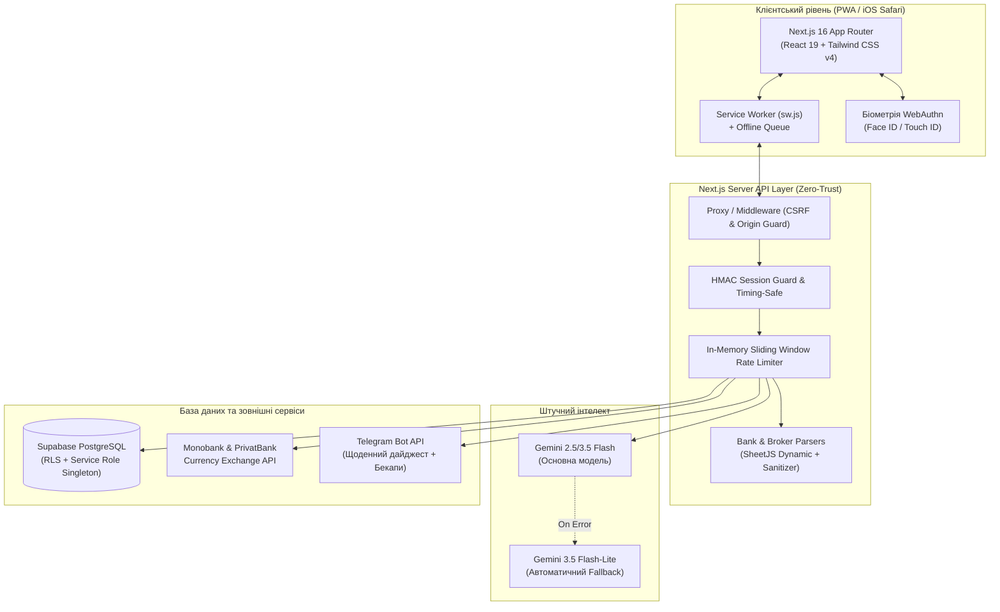

<div align="center">

# 🏛️ BudgetGraph AI

### _Next-Gen AI-Powered Personal Finance & Wealth OS_

[](https://nextjs.org/)
[](https://react.dev/)
[](https://www.typescriptlang.org/)
[](https://tailwindcss.com/)
[](https://supabase.com/)
[](https://ai.google.dev/)
[](https://vitest.dev/)
[](https://web.dev/progressive-web-apps/)

<p align="center">
  <b>Приватний, блискавичний та естетичний фінансовий командний центр.</b><br/>
  Поєднує безпарольну апаратну біометрію WebAuthn, глибоку аналітику інвестиційного капіталу, адаптивний темп зарплатних циклів (Burn Rate), радар підписок та інтелектуальний AI-асистент на базі Google Gemini.
</p>

[✨ Можливості](#-ключові-можливості) •
[🛡️ Безпека](#-архітектура-безпеки-zero-trust) •
[📐 Архітектура](#-архітектура-системи) •
[🚀 Швидкий старт](#-швидкий-старт) •
[🧪 Тестування](#-тестування-та-якість-коду) •
[📡 API ендпоінти](#-ключові-api-ендпоінти)

---

</div>

## 🌟 Ключові можливості

### 🧠 1. Надрозумний фінансовий інтелект (Gemini AI)

- **Миттєва класифікація через Apple Shortcuts:** фоновий ендпоінт `/api/classify` розпізнає сирий текст транзакцій Apple Pay за частки секунди, нормалізує назву мерчанта та призначає правильну категорію.
- **Каскадний Multi-Model Fallback:** основні аналітичні завдання виконує `gemini-3.5-flash`, а у разі збоїв чи перевантаження мережі система безшовно перемикається на `gemini-3.5-flash-lite` (`GEMINI_MODELS.FAST`) або `gemini-3.7-flash`.
- **AI Фінансовий радник:** аналізує динаміку видатків, прогнозує залишок до кінця зарплатного циклу та дає практичні рекомендації у висувній шторці `AIAnalysisDrawer`.
- **Personal CPI (Індекс персональної інфляції):** автоматичний розрахунок зваженого індексу подорожчання споживчого кошика за категоріями у компоненті `MoMComparison`.

### 🛡️ 2. Банківський рівень безпеки (Zero-Trust)

- **Апаратна біометрія WebAuthn (Passkeys / Face ID / Touch ID):** вхід без передачі секретів через FIDO2 з апаратним криптографічним лічильником `counter` для захисту від клонування ключів.
- **Sealed Challenge Tokens:** challenge для WebAuthn упаковується в криптографічно підписаний HMAC-токен у cookie, усуваючи зайвий `SELECT` до бази та гарантуючи нульову затримку верифікації (Zero DB Latency).
- **Константні операції:** захист від атак за часом (Timing Attacks) за допомогою `timingSafeEqual`.
- **In-Memory Rate Limiting:** активне обмеження частоти запитів для PIN-коду, біометричного входу та AI-маршрутів (із заголовками `Retry-After`).
- **Жорсткий CSP:** директива `connect-src: 'self'` надійно перекриває можливість ексфільтрації чутливих токенів через браузерні скрипти.

### 📈 3. Управління капіталом та інвестиціями (Wealth OS)

- **Облік активів:** акції, облігації (ОВДП), нерухомість (Inzhur REIT), криптовалюта та банківські депозити.
- **Розумний імпорт виписок:**
  - **Inzhur Import:** автоматичне розпізнавання Excel/CSV звітів брокера, парсинг транзакцій та перерахунок вартості сертифікатів.
  - **Bank Statements:** парсинг PDF/CSV виписок ПриватБанку та Monobank з фільтрацією банківського сміття (номери терміналів, міські мітки, технічні таймстемпи, ФОП).
- **Автоматична дедуплікація (Reconciliation):** якщо банківський переказ на Inzhur збігається з брокерською транзакцією, система автоматично відсікає дублікат.
- **Мультивалютний перерахунок:** динамічне оновлення курсів (USD, EUR, PLN, UAH) через API Monobank та ПриватБанку з надійним кешуванням.
- **Скарбнички та Фінансова подушка:** розрахунок показника безпеки Runway (кількість місяців автономного життя на збереженнях).

### ⏳ 4. Зарплатні цикли та адаптивний темп витрат

- **Cycle-First філософія:** замість штучних календарних місяців бюджет розраховується від зарплати до зарплати через єдиний модуль `src/lib/cycle-utils.ts`.
- **Burn Rate Chart:** динамічна траєкторія витрат на інтерактивному графіку Recharts, що показує ідеальну лінію темпу vs реальні щоденні витрати.
- **Спліт транзакцій:** можливість розділити великий чек (наприклад, супермаркет) на декілька підкатегорій з математичною перевіркою балансу до копійки.
- **М'яке видалення (Trash / Soft Delete):** 10-денний кошик із захистом від випадкового видалення та щоденним автоматичним клінінгом через cron-воркер.

### 🛰️ 5. Subscription Radar (Радар підписок)

- Автоматичний детектив періодичних платежів за сигнатурами суми та мерчанта.
- Можливість приховувати відомі підписки та додавати нові шаблони витрат в один тап.

### 📱 6. PWA & Offline-First стійкість

- **Багаторівневе кешування Service Worker (`public/sw.js`):**
  - _Network-Only:_ для авторизації та бекапів.
  - _Network-First з кеш-fallback:_ для фінансових даних.
  - _Stale-While-Revalidate:_ для статичних скриптів і стилів Next.js.
- **Офлайн-черга (`src/lib/offline-queue.ts`):** внесення транзакцій без інтернету із миттєвою синхронізацією при відновленні сигналу.
- **Мобільна ергономіка iOS:** повна адаптація під Safe Area (`env(safe-area-inset-bottom)`), шторки жестів (Drawers) та вимкнення небажаного еластичного скролу.

---

## 📐 Архітектура системи



---

## 🛠️ Технологічний стек

| Шар                  | Технологія                | Версія          | Призначення                                                   |
| :------------------- | :------------------------ | :-------------- | :------------------------------------------------------------ |
| **Framework**        | **Next.js (App Router)**  | `16.3.4`        | Серверні роути, Turbopack збірка, потоковий SSR               |
| **Core UI**          | **React & React DOM**     | `19.2.8`        | Декларативний інтерфейс останнього покоління                  |
| **Мова**             | **TypeScript**            | `5.9.3`         | Сувора типізація кодової бази (0 помилок `tsc`)               |
| **Стилізація**       | **Tailwind CSS**          | `v4.0`          | Сучасна оптимізована CSS-система нового покоління             |
| **База даних**       | **Supabase (PostgreSQL)** | `Latest`        | Row Level Security (RLS), міграції, параметризовані запити    |
| **Штучний інтелект** | **Google GenAI SDK**      | `@google/genai` | Моделі Gemini 2.5 Flash, 3.5 Flash-Lite, 3.7 Flash            |
| **Біометрія**        | **SimpleWebAuthn**        | `v13.x`         | Стандарт FIDO2 / Passkeys для Face ID та Touch ID             |
| **Кешування даних**  | **TanStack React Query**  | `v5.x`          | Автоматичне керування серверним стейтом та фонова інвалідація |
| **Візуалізація**     | **Recharts**              | `v2.x`          | Адаптивні графіки динаміки та темпу (Burn Rate)               |
| **Робота з файлами** | **SheetJS (`xlsx`)**      | `v0.18.5`       | Динамічний імпорт для збереження легкості початкового бандлу  |
| **Тестування**       | **Vitest**                | `v5.0.0`        | 218 швидкісних юніт- та інтеграційних тестів                  |
| **PWA**              | **Service Worker API**    | Native          | Трьохрівневе кешування та підтримка повної офлайн-роботи      |

---

## 🛡️ Архітектура безпеки (Zero-Trust)

> [!IMPORTANT]
> Проєкт розроблено з дотриманням принципу найменших привілеїв: секрети бази даних та сервісні ключі ніколи не виходять за межі захищеного серверного контуру.

1. **Захист від витоку даних (Strict CSP):**  
   Завдяки правилу `connect-src: 'self'` браузер блокує будь-які спроби надіслати мережеві запити на сторонні домени. Навіть у разі XSS зловмисник не зможе передати дані з браузера на сторонній сервер.
2. **Захист від ін'єкцій у файлах (CSV Formula Injection):**  
   Усі банківські виписки проходять екранування символів `=`, `+`, `-`, `@`, `\t`, `\r`, що блокує запуск макросів при експорті в Excel.
3. **Криптографічний захист сесій:**  
   Використовуються cookie з прапорцями `httpOnly: true`, `secure: true`, `sameSite: "strict"` та підписом HMAC-SHA256 (Web Crypto API).
4. **Defense-in-Depth для шорткатів:**  
   Ендпоінт `/api/classify` захищений як Bearer-токеном `APP_API_SECRET` з константним порівнянням часу, так і окремим ковзним вікном Rate Limiting (60 запитів/хв).

---

## 🚀 Швидкий старт

### Передумови

- **Node.js:** версія `22.x` або новіша
- **npm:** версія `10.x` або новіша
- Акаунт **Supabase** (PostgreSQL) та ключ **Google Gemini API**

### 1. Клонування репозиторію

```bash
git clone https://github.com/mindeclipse/Budget_graphAI.git
cd Budget_graphAI
```

### 2. Встановлення залежностей

```bash
npm ci --legacy-peer-deps
```

### 3. Налаштування змінних оточення

Створіть файл `.env.local` у корені проєкту за таким зразком:

```env
# База даних Supabase
NEXT_PUBLIC_SUPABASE_URL=https://your-project.supabase.co
NEXT_PUBLIC_SUPABASE_ANON_KEY=your-anon-key
SUPABASE_SERVICE_ROLE_KEY=your-service-role-key

# Доступ до додатку та авторизація
APP_ACCESS_PIN=1234
APP_API_SECRET=your-32-byte-secret-key-for-shortcuts-and-hmac

# Google Gemini API
GEMINI_API_KEY=your-gemini-api-key

# Сповіщення Telegram (опціонально)
TELEGRAM_BOT_TOKEN=your-bot-token
TELEGRAM_CHAT_ID=your-chat-id
CRON_SECRET=your-cron-secret-key
```

### 4. Запуск у режимі розробки

```bash
npm run dev
```

Відкрийте [http://localhost:3000](http://localhost:3000) у вашому браузері.

---

## 🧪 Тестування та якість коду

Проєкт покритий 29 тестовими сьютами, що тестують усі критичні бізнес-правила (фінансову математику, криптографію, парсери, фаззинг, валідацію схем).

```bash
# Запуск повного набору тестів (218 тестів)
npm test

# Запуск перевірки типів TypeScript
npx tsc --noEmit

# Перевірка форматування коду Prettier
npm run format:check

# Автоматичне вирівнювання стилю коду
npm run format

# Перевірка виробничої збірки (Turbopack)
npm run build
```

Перед кожним `git push` автоматично спрацьовує локальний `pre-push hook`, який гарантує, що невідформатований або зламаний код ніколи не потрапить до репозиторію.

---

## 📡 Ключові API ендпоінти

| Маршрут                     |     Метод      | Призначення                                | Захист                                         |
| :-------------------------- | :------------: | :----------------------------------------- | :--------------------------------------------- |
| `/api/auth`                 |     `POST`     | Вхід за PIN-кодом, видача HMAC-куки        | Rate Limiter, Constant-Time PIN check          |
| `/api/auth/webauthn/login`  | `GET` / `POST` | Генерація challenge та вхід через Passkeys | Rate Limiter, Sealed Challenge, Counter Check  |
| `/api/classify`             |     `POST`     | Класифікація транзакцій Apple Shortcuts    | Bearer Token, AI Rate Limiter, Gemini Fallback |
| `/api/ai/analyze`           |     `POST`     | Комплексний фінансовий AI-аудит циклу      | Session Token, Rate Limiter (10/хв)            |
| `/api/ai/chat`              |     `POST`     | Інтерактивний діалог з AI-консультантом    | Session Token, Rate Limiter (25/хв)            |
| `/api/transactions`         | `GET` / `POST` | Отримання списку витрат та додавання нової | Session Token, Zod-валідація                   |
| `/api/transactions/split`   |     `POST`     | Розподіл чека на кілька підкатегорій       | Session Token, Penny Balance Check             |
| `/api/transactions/restore` |     `POST`     | Відновлення транзакції з кошика            | Session Token, TanStack Cache Invalidation     |
| `/api/recurring/radar`      |     `GET`      | Виявлення прихованих підписок              | Session Token, Pattern Engine                  |
| `/api/cron/digest`          |     `GET`      | Щоденний вечірній дайджест у Telegram      | `CRON_SECRET` Bearer Authorization             |

---

## 📄 Ліцензія

Цей проєкт розповсюджується під ліцензією **MIT**. Ви можете вільно використовувати, адаптувати та вдосконалювати його для власних потреб.

<div align="center">
  <sub>Розроблено з увагою до найменших деталей, математичної точності та цифрової конфіденційності.</sub>
</div>
